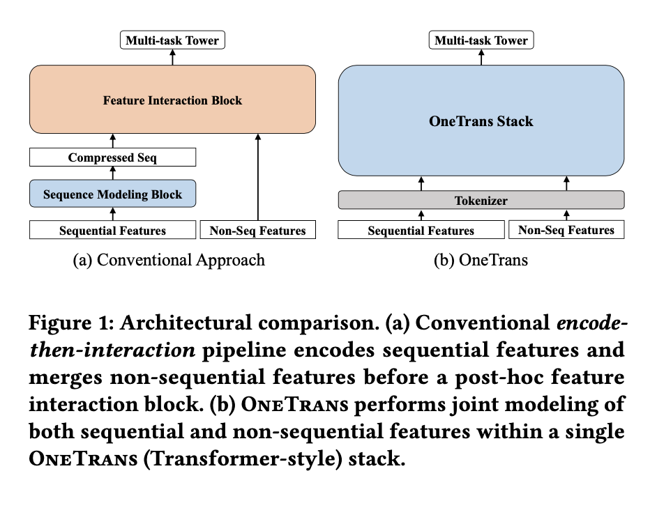
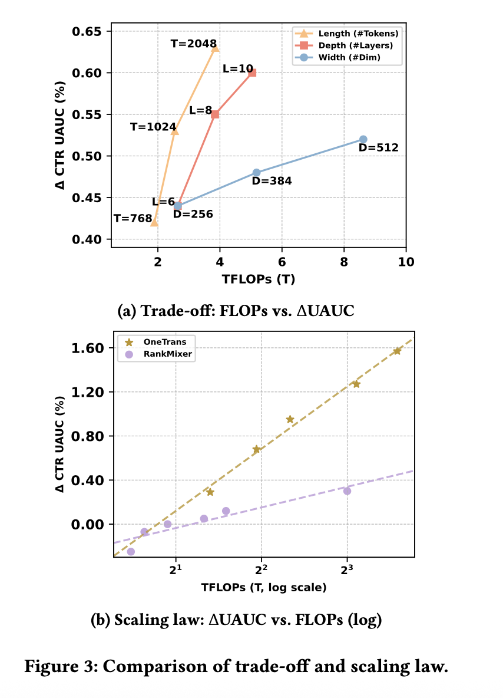

# OneTrans：工业级推荐系统中融合特征交互与序列建模的统一Transformer模型
赵启∗  
南洋理工大学 字节跳动 新加坡，新加坡  
zhaoqi.zhang@bytedance.com  
裴浩磊∗  
字节跳动 新加坡，新加坡  
haolei.pei@bytedance.com  
郭俊∗  
字节跳动 新加坡，新加坡  
jun.guo@bytedance.com  
王天予  
字节跳动 新加坡，新加坡  
tianyu.wang01@bytedance.com  
冯宇飞  
字节跳动 杭州，中国  
fengyihui@bytedance.com  
孙辉  
字节跳动 杭州，中国  
sunhui.sunh@bytedance.com  
刘少伟†  
字节跳动 新加坡，新加坡  
liushaowei.nphard@bytedance.com  
孙爱欣†  
南洋理工大学 新加坡，新加坡  
axsun@ntu.edu.sg

## 摘要
在推荐系统中，扩大特征交互模块（如Wukong、RankMixer）或用户行为序列模块（如LONGER）的规模已取得显著成功。然而，这些研究通常沿着独立的方向推进，不仅阻碍了双向信息交换，还无法实现统一优化与规模扩展。本文提出OneTrans——一种统一的Transformer骨干网络，能够同时执行用户行为序列建模和特征交互。OneTrans采用统一的分词器，将序列型和非序列型属性均转换为单一token序列；堆叠的OneTrans块在相似序列token间共享参数，同时为非序列token分配专属参数。通过因果注意力和跨请求KV缓存，OneTrans支持中间表示的预计算与缓存，显著降低了训练和推理阶段的计算成本。工业级数据集上的实验结果表明，OneTrans随着参数增加实现高效扩展，持续优于强基准模型，且在在线A/B测试中使人均商品交易总额（GMV）提升5.68%。

## CCS概念
• 信息系统 ￫ 推荐系统

## 关键词
推荐系统，排序模型，缩放定律

## ACM参考文献格式
赵启、裴浩磊、郭俊、王天予、冯宇飞、孙辉、刘少伟、孙爱欣. 2025. OneTrans：工业级推荐系统中融合特征交互与序列建模的统一Transformer模型. 《[请从版权确认邮件中填写正确会议名称]论文集》（会议缩写’XX）. ACM，美国纽约州纽约市，9页.

## 1 引言
推荐系统（RecSys）在各类信息服务中发挥着基础性作用，如电子商务[9, 31]、流媒体[2, 19, 26]和社交网络[28]等。工业级推荐系统通常采用级联排序架构[6, 16, 21]：首先，召回阶段从十亿级语料库中筛选出数百个候选物品[13, 32]；随后，排序阶段（通常包含粗排和精排）对每个候选物品进行评分，并返回前k个物品[11, 25, 26, 28, 33]。

本文聚焦于排序阶段。主流排序方法围绕两个独立模块展开迭代：（a）序列建模——利用局部注意力或Transformer编码器，将用户多行为序列编码为候选感知表示[1, 14, 23, 31]；（b）特征交互——通过因子分解、显式交叉网络或特征组注意力，学习非序列特征（如用户画像、物品画像、上下文）间的高阶交叉[11, 12, 25, 33]。如图1(a)所示，这些方法通常将用户行为编码为压缩的序列表示，再与非序列特征拼接，通过特征交互模块学习高阶交互；我们将这种设计称为“先编码后交互”流水线。

  
图1：架构对比。(a) 传统“先编码后交互”流水线：先编码序列特征，再与非序列特征融合，最后通过后续特征交互模块处理；(b) OneTrans：在单一OneTrans（Transformer风格）堆叠中对序列和非序列特征进行联合建模

大型语言模型（LLMs）的成功表明，扩大模型规模（如参数数量、训练数据）能带来可预测的性能提升[15]，这启发了推荐系统领域的类似研究[1, 28, 33]。在特征交互方面，Wukong[28]堆叠带有线性压缩的因子分解机（FM）块以捕捉高阶特征交互，并建立了缩放定律；RankMixer[33]通过硬件友好的token混合与token专属前馈网络（FFNs）实现了良好的缩放效果。在序列建模方面，LONGER[1]将因果Transformer应用于长用户历史，表明扩大深度和宽度能带来单调提升。尽管这些方法在实践中有效，但将序列建模和特征交互作为独立模块分离存在两大局限：首先，“先编码后交互”流水线限制了双向信息流，阻碍了静态/上下文特征对序列表示的塑造[27]；其次，模块分离导致执行流程碎片化并增加延迟，而单一Transformer风格的骨干网络可复用LLM的优化技术（如KV缓存、内存高效注意力、混合精度），实现更有效的规模扩展[11]。

本文提出OneTrans——一种创新的架构范式，采用统一的Transformer骨干网络，联合执行用户行为序列建模和特征交互。如图1(b)所示，OneTrans在统一骨干网络中支持双向信息交换。它通过统一分词器将序列特征（多样化行为序列）和非序列特征（静态用户/物品及上下文特征）转换为单一token序列，再由为工业级推荐系统量身定制的Transformer变体——堆叠的OneTrans块构成的金字塔结构处理。与LLMs中仅含文本token不同，推荐系统中的token来源多样，因此每个OneTrans块采用类似HiFormer[11]的混合参数化方案：所有序列token（来自序列特征）共享一组Q/K/V和FFN权重，而每个非序列token（来自非序列特征）分配专属参数以保留其独特语义。

与传统“先编码后交互”框架不同，OneTrans通过统一的因果Transformer骨干网络，打破了序列特征与非序列特征之间的架构壁垒。这种设计使推荐系统的缩放与LLM实践保持一致：整个模型可通过调整骨干网络的深度和宽度实现扩展，同时无缝继承成熟的LLM优化技术（如FlashAttention[7]、混合精度训练[17]）。特别是跨候选和跨请求KV缓存[1]将会话（含C个候选）的时间复杂度从$O(C)$降至$O(1)$，使大规模OneTrans部署成为可能。

综上，本文的主要贡献包括四点：（1）统一框架：提出OneTrans——一种用于排序的单一Transformer骨干网络，配备统一分词器（将序列和非序列特征编码为单一token序列）和统一Transformer块（联合执行序列建模和特征交互）；（2）推荐系统定制化：为弥合LLMs与推荐系统任务的差距，OneTrans引入混合参数化方案——为多样化非序列token分配专属参数，为所有序列token共享参数；（3）高效训练与服务：通过逐步裁剪序列token的金字塔策略，以及跨请求KV缓存（复用候选间的用户侧计算）提升效率；此外，采用FlashAttention、混合精度训练和半精度推理等LLM优化技术，进一步降低内存占用和计算量；（4）扩展与部署：OneTrans随着模型规模扩大呈现近对数线性的性能提升，为真实生产数据中的缩放定律提供了实证；在线部署时，在保持工业级延迟的同时，实现了业务关键指标（KPIs）的统计显著提升。

## 2 相关工作
早期推荐系统（如DIN[31]及其会话感知变体DSIN[9]）采用局部注意力学习候选相关的用户历史摘要，但每个候选将行为压缩为固定长度向量，限制了长程依赖建模[30]。SASRec[14]、BERT4Rec[23]、BST[4]等自注意力方法通过允许每个位置关注完整历史，消除了这一瓶颈，并通过双向掩码提升了样本效率。近年来，随着推荐系统中缩放定律[15]的探索日益深入，LONGER[1]通过高效注意力和服务友好设计，将序列建模推向工业级规模。然而，在主流流水线中，这些序列编码器通常与特征交互堆叠分离，导致与静态上下文特征的晚期融合而非联合优化[27]。

在特征交互方面，早期推荐系统依赖手工设计的交叉特征或自动乘法交互层。Wide&Deep[5]、FM/DeepFM[3, 12]、DCN/DCNv2[24, 25]等经典模型提供了高效的低阶或有界度交互。然而，近期缩放研究发现[28]，一旦模型堆叠足够多的交叉层，继续增加层数将不再带来提升，模型性能会进入平台期。为克服预设交叉形式的局限性，基于注意力的方法自动学习高阶交互：AutoInt[22]学习任意阶关系，HiFormer[11]引入组专属投影以更好地捕捉异质、非对称交互。随着特征交互模块的规模扩大，Wukong[28]等大规模系统通过堆叠带有线性压缩的FM风格交互块实现可预测提升；RankMixer[33]在严格延迟约束下，通过并行token混合和稀疏混合专家（MoE）实现良好缩放。然而，这些交互模块通常遵循“先编码后交互”范式，将交互推向独立阶段，阻碍了与用户序列建模的统一优化[27]。

迄今为止，推荐系统的进展主要沿着两个独立方向推进：序列建模和特征交互。InterFormer[27]尝试通过基于摘要的双向交叉架构弥合这一差距，实现两个组件间的相互信号交换。然而，它仍将两者视为独立模块，且交叉架构引入了架构复杂性和执行碎片化。缺乏用于联合建模和优化的统一骨干网络，使得系统作为整体的规模扩展仍具挑战。

## 3 方法
在详细描述方法前，先简要说明任务设定。在级联工业级推荐系统中，每次召回阶段为用户$u$返回候选集（通常含数百个候选物品）。排序模型随后为每个候选物品$i$预测分数：
$$\hat{y}_{u,i} = f(i \mid \mathcal{NS}, \mathcal{S}; \Theta) \tag{1}$$
其中$\mathcal{NS}$是来自用户、候选物品和上下文的非序列特征集；$\mathcal{S}$是用户的历史行为序列集；$\Theta$是可训练参数。常见任务预测包括点击率（CTR）和点击后转化率（CVR）：
$$\begin{aligned}
& CTR_{u,i} = P(click=1 \mid \mathcal{NS}, \mathcal{S}; \Theta), \\
& CVR_{u,i} = P(conv=1 \mid click=1, \mathcal{NS}, \mathcal{S}; \Theta).
\end{aligned} \tag{2}$$

### 3.1 OneTrans框架概述
如图2(a)所示，OneTrans采用统一分词器，将序列特征$\mathcal{S}$映射为S-token，将非序列特征$\mathcal{NS}$映射为NS-token。随后，金字塔堆叠的Transformer在单一计算图中联合处理统一token序列。初始token序列表示为：
$$X^{(0)} = [\text{S-token}; \text{NS-token}] \in \mathbb{R}^{(L_S + L_{NS}) \times d} \tag{3}$$
该token序列由$L_S$个S-token和$L_{NS}$个NS-token拼接而成，所有token的维度均为$d$。需注意，S-token中插入了可学习的[SEP]token，用于分隔不同类型的用户行为序列。如图2(b)所示，每个OneTrans块通过以下步骤逐步优化token状态：
$$Z^{(n)} = \text{MixedMHA}(\text{Norm}(X^{(n-1)})) + X^{(n-1)} \tag{4}$$
$$X^{(n)} = \text{MixedFFN}(\text{Norm}(Z^{(n)})) + Z^{(n)} \tag{5}$$
其中，混合多头注意力（MixedMHA）和混合前馈网络（MixedFFN）采用混合参数化策略（见图2(c)）——在注意力层和前馈层中，序列token共享权重，非序列token分配独立参数。

![系统架构。(a) OneTrans概述：序列（S，蓝色）和非序列（NS，橙色）特征分别分词；在用户行为序列间插入[SEP]后，统一token序列输入堆叠的OneTrans金字塔块，逐步缩减token长度直至与NS-token数量匹配；(b) OneTrans块：含RMSNorm、混合因果注意力和混合FFN的因果预归一化Transformer块；(c) “混合”=混合参数化：S-token共享一组QKV/FFN权重，每个NS-token拥有专属QKV/FFN](figures/f2.png)  
图2：系统架构。(a) OneTrans概述：序列（S，蓝色）和非序列（NS，橙色）特征分别分词；在用户行为序列间插入[SEP]后，统一token序列输入堆叠的OneTrans金字塔块，逐步缩减token长度直至与NS-token数量匹配；(b) OneTrans块：含RMSNorm、混合因果注意力和混合FFN的因果预归一化Transformer块；(c) “混合”=混合参数化：S-token共享一组QKV/FFN权重，每个NS-token拥有专属QKV/FFN

统一的因果掩码施加自回归约束，限制每个位置仅能关注前面的token。具体而言，NS-token可关注所有S-token历史，从而实现全面的跨token交互。通过堆叠此类块并对S-token应用金字塔式尾部裁剪，模型逐步将紧凑的高阶信息提炼到NS-token中。最终token状态随后传入任务专属头进行预测。

通过将非序列和序列特征统一为单一token序列，并采用因果Transformer建模，OneTrans脱离了传统“先编码后交互”流水线。这种统一设计自然支持：（i）每个行为序列内的序列内交互；（ii）多个序列间的跨序列交互；（iii）物品、用户和上下文特征间的多源特征交互；（iv）序列-特征交互——所有交互均在单一Transformer堆叠中完成。

统一公式使我们能够无缝继承成熟的LLM工程优化（包括KV缓存和内存高效注意力），从而大幅降低推理延迟。我们认为这种统一公式非常适合在单一、可扩展架构中解决多序列和跨域推荐挑战。接下来详细描述设计细节。

### 3.2 特征与分词
为构建初始token序列$X^{(0)}$，OneTrans首先应用特征预处理流水线，将所有原始特征输入映射为嵌入向量。这些嵌入随后分为（i）多行为序列子集和（ii）代表用户、物品或上下文特征的非序列子集，每个子集采用独立分词器。

#### 3.2.1 非序列分词
非序列特征$\mathcal{NS}$包括数值输入（如价格、点击率）和类别输入（如用户ID、物品类别）。所有特征经过分桶或独热编码后进行嵌入。由于工业级系统通常包含数百个重要性各异的特征，控制非序列token数量$L_{NS}$有两种选择：
- 组级分词器（与RankMixer[33]一致）：将特征手动划分为语义组$\{g_1, ..., g_{L_{NS}}\}$，每个组拼接后通过组专属MLP：
  $$\text{NS-token} = [\text{MLP}_1(\text{concat}(g_1)), ..., \text{MLP}_{L_{NS}}(\text{concat}(g_{L_{NS}}))] \tag{6}$$
- 自动拆分分词器：将所有特征拼接后通过单个MLP投影，再拆分：
  $$\text{NS-token} = \text{split}(\text{MLP}(\text{concat}(\mathcal{NS})), L_{NS}) \tag{7}$$
自动拆分分词器通过单一稠密投影减少核启动开销。我们将通过实验评估两种选择。最终，非序列分词生成$L_{NS}$个非序列token，每个维度为$d$。

#### 3.2.2 序列分词
OneTrans接收多行为序列：
$$\mathcal{S} = \{S_1, ..., S_n\}, S_i = [e_{i1}, ..., e_{iL_i}] \tag{8}$$
每个序列$S_i$包含$L_i$个事件嵌入$e$，由物品ID与其对应的物品类别、价格等辅助信息拼接而成。

多行为序列的原始维度可能不同。因此，对每个序列$S_i$，使用一个共享投影$\text{MLP}_i$将所有事件$e_{ij}$转换为统一维度$d$：
$$\tilde{S}_i = [\text{MLP}_i(e_{i1}), ..., \text{MLP}_i(e_{iL_i})] \in \mathbb{R}^{L_i \times d} \tag{9}$$

对齐后的序列$\tilde{S}_i$通过以下两种规则之一合并为单一token序列：1）时间戳感知：按时间交错所有事件，并添加序列类型指示符；2）时间戳无关：按事件影响拼接序列（如购买→加入购物车→点击），在序列间插入可学习的[SEP]token。后者中，用户意图更强的行为置于序列前部。消融结果表明，当时间戳可用时，时间戳感知规则优于影响排序规则。形式化表示为：
$$\text{S-token} = \text{Merge}(\tilde{S}_1, ..., \tilde{S}_n) \in \mathbb{R}^{L_S \times d}, L_S = \sum_{i=1}^n L_i + L_{SEP} \tag{10}$$
其中$L_{SEP}$是[SEP]token的数量。

### 3.3 OneTrans块
如图2(b)所示，每个OneTrans块是应用于归一化token序列的预归一化因果Transformer：$L_S$个序列S-token后接$L_{NS}$个非序列NS-token。受异质特征组研究结果[11]启发，我们对Transformer进行轻量级修改，支持混合参数方案（见图2(c)）：同类S-token共享一组参数；来自不同来源/语义的异质NS-token分配专属参数。

与LLM输入不同，推荐系统中的token序列结合了序列S-token和多样的NS-token，其数值范围和统计特性差异显著。后归一化设置可能因这些差异导致注意力崩溃和训练不稳定性。为避免此问题，我们对所有token应用RMSNorm[29]作为预归一化，对齐不同token类型的尺度，稳定优化过程。

#### 3.3.1 混合（共享/专属）因果注意力
OneTrans采用标准多头注意力（MHA）与因果注意力掩码，唯一修改是Q/K/V的参数化方式。设$x_i \in \mathbb{R}^d$为第$i$个token，计算Q/K/V时，S-token（$i \leq L_S$）使用共享投影，NS-token（$i > L_S$）使用$L_{NS}$个专属投影：
$$(q_i, k_i, v_i) = (W_i^Q x_i, W_i^K x_i, W_i^V x_i) \tag{11}$$
其中$W_i^\Psi$（$\Psi \in \{Q, K, V\}$）遵循混合参数化方案：
$$W_i^\Psi = \begin{cases} 
W_S^\Psi, & i \leq L_S \text{（S-token共享）}, \\
W_{NS,i}^\Psi, & i > L_S \text{（NS-token专属）}.
\end{cases} \tag{12}$$

注意力采用标准因果掩码，NS-token置于S-token之后。这带来三方面效果：（1）S侧：每个S-token仅关注前面的S位置；时间戳感知序列中，每个事件依赖其历史；时间戳无关序列（按意图排序，如购买→加入购物车→点击/曝光）中，因果掩码让强意图信号指导和过滤后续弱意图行为。（2）NS侧：每个NS-token关注完整S历史（本质上是序列证据的目标注意力聚合）和前面的NS-token，增加token级交互多样性。（3）金字塔支持：S侧和NS侧的因果掩码均逐步将信息集中到后面的位置，自然支持逐层裁剪token的金字塔调度（详见下文）。

#### 3.3.2 混合（共享/专属）FFN
类似地，前馈网络采用相同参数化策略：NS-token使用专属FFN，S-token使用共享FFN：
$$\text{MixedFFN}(x_i) = W_i^2 \phi(W_i^1 x_i) \tag{13}$$
其中$W_i^1$和$W_i^2$遵循式(12)的混合参数化，即$i \leq L_S$时共享，$i > L_S$时专属。

综上，相较于标准因果Transformer，OneTrans仅修改参数化：NS-token使用专属QKV和FFN；S-token共享一组参数。单一因果掩码将序列绑定，使NS-token能够聚合完整行为历史，同时保留高效的Transformer风格计算。

### 3.4 金字塔堆叠
如3.3节所述，因果掩码将信息集中到后面的位置。利用这种近期性结构，我们采用金字塔调度：在每个OneTrans块层，仅最新的部分S-token生成查询（query），而键（key）/值（value）仍基于完整序列计算；查询集随深度缩减。

设$X = \{x_i\}_{i=1}^L$为输入token列表，$Q = \{L-L'+1, ..., L\}$为尾部索引集（$L' \leq L$）。根据式(12)，修改查询生成（仅$i \in Q$）：
$$q_i = W_i^Q x_i, i \in Q \tag{14}$$
键和值仍基于完整序列$\{1, ..., L\}$正常计算。注意力后仅保留$i \in Q$的输出，将token长度缩减至$L'$，形成跨层的金字塔结构。

该设计带来两大优势：（i）渐进提炼：长行为历史被漏斗式导入少量尾部查询，将模型容量集中在最具信息量的事件上，并将信息整合到NS-token中；（ii）计算效率：注意力成本变为$O(LL'd)$，FFN随$L'$线性扩展；缩减查询集直接降低浮点运算量（FLOPs）和激活内存占用。

### 3.5 训练与部署优化
#### 3.5.1 跨请求KV缓存
在工业级推荐系统中，同一请求的样本在训练和服务时连续处理：S-token在所有候选间保持一致，NS-token因候选物品而异。利用这一结构，我们将广泛采用的KV缓存[1]整合到OneTrans，形成统一的两阶段范式：
- 阶段I（S侧，每请求一次）：通过因果掩码处理所有S-token，缓存其键/值对和注意力输出；该阶段每请求执行一次。
- 阶段II（NS侧，每候选一次）：对每个候选，计算其NS-token，与缓存的S侧键/值进行交叉注意力，随后通过专属FFN层。特别地，候选专属序列（如SIM[20]）通过池化预聚合为NS-token，因无法复用共享S侧缓存。

KV缓存将S侧计算在候选间摊销，使每候选工作轻量化，消除冗余计算，大幅提升吞吐量。

由于用户行为序列是追加式的，我们将KV缓存扩展到跨请求：每个新请求复用之前的缓存，仅为新增行为计算增量键/值。这将每请求序列计算从$O(L)$降至$O(\Delta L)$，其中$\Delta L$是自上次请求以来的新增行为数。

#### 3.5.2 统一LLM优化
我们采用FlashAttention-2[8]，通过分块和核融合减少注意力的I/O和平方级激活占用，在训练和推理中均实现更低内存占用和更高吞吐量。为进一步缓解内存压力，使用混合精度训练（BF16/FP16）[18]结合激活重计算[10]——丢弃选定的前向激活，在反向传播时重新计算。这种组合以少量额外计算为代价，大幅节省内存，无需架构修改即可支持更大批次和更深模型。

## 4 实验
通过离线评估和在线测试，我们旨在回答以下研究问题（RQs）：
- RQ1：统一堆叠vs“先编码后交互”：在计算量相当的情况下，单一Transformer堆叠是否能带来持续的性能提升？
- RQ2：哪些设计选择关键？通过对输入层（如分词器、序列融合）和OneTrans块（如参数共享、注意力类型、金字塔堆叠）进行消融，评估不同设计选择对性能和效率的重要性。
- RQ3：系统效率：金字塔堆叠、跨请求KV缓存、FlashAttention-2和带重计算的混合精度，是否能在相同OneTrans图下降低FLOPs/内存占用和延迟？
- RQ4：缩放定律：当扩大长度（token序列长度）、宽度（$d_{model}$）、深度（层数）时，损失/性能是否呈现预期的对数线性趋势？
- RQ5：在线A/B测试：在工业级延迟约束下，在线部署OneTrans是否能使关键业务指标（如人均订单数、人均GMV）实现统计显著提升？

### 4.1 实验设置
#### 4.1.1 数据集
离线评估中，我们在大规模工业级排序场景下使用生产日志评估OneTrans（严格遵循隐私合规，所有个人身份信息均匿名化和哈希处理）。数据按时间分割，所有特征在曝光时快照，避免时间泄露，确保在线-离线一致性。标签（如点击、订单）在与生产设置对齐的固定窗口内聚合。表1总结数据集统计信息。

表1：OneTrans实验的数据集概述
| 指标 | 数值 |
| --- | --- |
| 曝光量（样本数） | 29.1B |
| 独立用户数 | 27.9M |
| 独立物品数 | 10.2M |
| 日均曝光量（均值±标准差） | 118.2M ± 14.3M |
| 日活跃用户数（均值±标准差） | 2.3M ± 0.3M |

#### 4.1.2 任务与指标
评估式(2)定义的两个二分类排序任务：CTR和CVR。性能指标采用AUC和UAUC（曝光加权用户级AUC）。

下一批次评估：数据按时间处理。对每个迷你批次，（i）在评估模式下记录预测，（ii）在同一批次上训练。AUC和UAUC每日基于当天预测计算，最终跨天宏观平均。

效率指标：报告参数数量（Params，不含稀疏嵌入的模型参数）和TFLOPs（批次大小2048时的训练计算量，单位TFLOPs）。

#### 4.1.3 基准模型
使用相同特征和匹配计算预算，构建工业级标准模型组合作为基准。在“先编码后交互”范式下，以广泛使用的生产基准DCNv2+DIN[25, 31]为起点，逐步增强特征交互模块：DCNv2→Wukong[28]→HiFormer[11]→RankMixer[33]；固定RankMixer后，改变序列建模模块：StackDIN→Transformer[4]→LONGER[1]。

#### 4.1.4 超参数设置
报告两种设置：OneTransS使用6个堆叠OneTrans块，宽度$d=256$，4个注意力头，目标参数约1亿；OneTransL（默认）扩展到8层，宽度$d=384$（仍为4个注意力头）。输入通过统一分词器处理：多行为序列以时间戳感知方式融合，非序列特征通过自动拆分分词。金字塔调度将token从1190个线性缩减至12个。

优化与基础设施：采用无权重衰减的双优化器策略——稀疏嵌入使用Adagrad优化（$\beta_1=0.1$，$\beta_2=1.0$），稠密参数使用RMSPropV2优化（学习率=0.005，动量=0.99999）。训练时每GPU批次大小设为2048，稠密层梯度裁剪阈值为90，稀疏层为120，确保优化稳定。在线推理时，每GPU采用更小批次大小100，平衡吞吐量和延迟。训练在16个H100 GPU上采用数据并行全归约。

### 4.2 RQ1：性能评估
以DCNv2+DIN（我们场景中预缩放的生产基准）为对比锚点（表2）。在“先编码后交互”范式下，独立扩大任一组件均有益：升级特征交互模块（DCNv2→Wukong→HiFormer→RankMixer）或序列建模模块（StackDIN→Transformer→LONGER），均能持续提升CTR AUC/UAUC和CVR AUC。在我们的系统中，这些指标提升超过+0.1%被视为有意义，超过+0.3%通常对应在线A/B测试中的统计显著效果。然而，由于人均样本量较小且波动性较高，CVR UAUC的解读需谨慎。

表2：离线效果（CTR/CVR）和效率；AUC/UAUC越高越好。效率数据来自先前工作，横线表示不可用。*表示按时间顺序部署在我们生产流程中的模型：DCNv2+DIN→RankMixer+DIN→RankMixer+Transformer→OneTransS→OneTransL（默认）
| 类型 | 模型 | CTR | | CVR（订单） | | 效率 | |
| --- | --- | --- | --- | --- | --- | --- | --- |
| | | AUC ￪ | UAUC ￪ | AUC ￪ | UAUC ￪ | 参数（M） | TFLOPs |
| (1) 基准模型 | DCNv2 + DIN（基准）* | 0.79623 | 0.71927 | 0.90361 | 0.71955 | 10 | 0.06 |
| (2) 特征交互 | Wukong + DIN | +0.08% | +0.11% | +0.14% | +0.11% | 28 | 0.54 |
| | HiFormer + DIN | +0.11% | +0.18% | +0.23% | -0.20% | 108 | 1.35 |
| | RankMixer + DIN* | +0.27% | +0.36% | +0.43% | +0.19% | 107 | 1.31 |
| (3) 序列建模 | RankMixer + StackDIN | +0.40% | +0.37% | +0.63% | -1.28% | 108 | 1.43 |
| | RankMixer + LONGER | +0.49% | +0.59% | +0.47% | +0.44% | 109 | 1.87 |
| | RankMixer + Transformer* | +0.57% | +0.90% | +0.52% | +0.75% | 109 | 2.51 |
| (4) 统一框架 | OneTrans S* | +1.13% | +1.77% | +0.90% | +1.66% | 91 | 2.64 |
| | OneTrans L（默认）* | +1.53% | +2.79% | +1.14% | +3.23% | 330 | 8.62 |

转向统一设计，OneTransS相较于基准提升+1.13%/+1.77%（CTR AUC/UAUC）和+0.90%/+1.66%（CVR AUC/UAUC）。在参数规模相当的情况下，它也优于训练FLOPs相近的RankMixer+Transformer（2.64T vs. 2.51T），证明了统一建模的优势。进一步扩展后，OneTransL实现最佳整体提升：+1.53%/+2.79%（CTR AUC/UAUC）和+1.14%/+3.23%（CVR AUC/UAUC），表明随着模型容量增长，性能呈现可预测提升。

综上，在单一Transformer中统一序列建模和特征交互，相较于独立扩大任一组件，能带来更可靠、计算高效的提升。

### 4.3 RQ2：设计选择消融研究
对所提出的OneTransS模型进行消融研究，量化关键设计选择的贡献，完整结果总结于表3。评估以下变体：
- 输入变体：i）用组级分词器替代自动拆分分词器（第1行）；ii）使用时间戳无关融合策略替代时间戳感知序列融合（第2行）；iii）在时间戳无关融合中移除[SEP]token（第3行）；
- OneTrans块变体：i）所有token共享一组Q/K/V和FFN参数，而非为NS-token分配独立参数（第4行）；ii）用全注意力替代因果注意力（第5行）；iii）禁用金字塔堆叠，所有层保留完整token序列（第6行）。

表3：输入设计和OneTrans块设计选择的影响，以OneTransS模型为参考
| 类型 | 变体 | CTR | | CVR（订单） | | 效率 | |
| --- | --- | --- | --- | --- | --- | --- | --- |
| | | AUC ￪ | UAUC ￪ | AUC ￪ | UAUC ￪ | 参数（M） | TFLOPs |
| 输入 | 组级分词器 | -0.10% | -0.30% | -0.12% | -0.10% | 78 | 2.35 |
| | 时间戳无关融合 | -0.09% | -0.22% | -0.20% | -0.21% | 91 | 2.64 |
| | 无[SEP]的时间戳无关融合 | -0.13% | -0.32% | -0.29% | -0.33% | 91 | 2.62 |
| OneTrans块 | 共享参数 | -0.15% | -0.29% | -0.14% | -0.29% | 24 | 2.64 |
| | 全注意力 | +0.00% | +0.01% | -0.03% | +0.06% | 91 | 2.64 |
| | 无金字塔堆叠 | -0.05% | +0.06% | -0.04% | -0.42% | 92 | 8.08 |

消融结果表明：1）自动拆分分词器相较于手动将非序列特征分组为token具有明显优势，表明允许模型自动构建非序列token比依赖人工定义的特征分组更有效；2）当时间戳存在时，时间戳感知融合优于基于意图的排序，说明应优先考虑时间顺序而非事件影响；3）在时间戳无关融合中，可学习的[SEP]token帮助模型分离序列；4）为NS-token分配专属参数相较于所有token共享一组参数带来明显提升，证明通过个性化投影建模非序列特征能实现更好的特征区分；5）因果注意力和全注意力效果相近，表明在该场景中允许token关注未来位置并非关键；需强调的是，全注意力禁止使用KV缓存等标准优化；6）所有层保留完整token列表无任何益处：OneTrans能有效将信息总结到少量尾部token中，因此金字塔设计可安全裁剪查询以节省计算。

### 4.4 RQ3：系统效率
为量化3.5节中的优化效果，在未优化的OneTransS基准上进行消融，报告训练/推理指标（表5）。未优化的OneTrans训练运行时间为407毫秒，峰值训练内存53.13 GB；99分位（p99）推理延迟54.00毫秒，推理内存1.70 GB（p99是高可用在线服务的标准服务等级目标（SLO）指标）。这些差异反映了不同的运行条件：离线训练使用大批次，在线推理在机器间分配微批次以保证稳定性。如表所示：1）金字塔堆叠通过将长行为历史压缩为紧凑查询集，实现显著节省（训练时间-28.7%，训练内存-42.6%，推理延迟-8.4%，推理内存-6.9%）；2）跨请求KV缓存消除冗余序列侧计算，训练和服务中的运行时间/延迟降低约30%，内存降低约50%；3）FlashAttention主要有益于训练，运行时间降低约50%，激活内存降低约58%；推理收益温和（延迟和内存降低约11-12%），因为注意力在大批次和反向传播中主导训练成本；4）带重计算的混合精度带来最大服务收益：p99延迟降低约69%，推理内存降低约30%，因为推理可全程以低精度运行；相比之下，训练必须保留全精度优化器状态和梯度累加器，但即便如此，训练运行时间和内存仍分别改善约32%和49%。

表4：OneTransL与DCNv2+DIN基准的关键效率对比
| 指标 | DCNv2+DIN | OneTrans L |
| --- | --- | --- |
| TFLOPs | 0.06 | 8.62 |
| 参数（M） | 10 | 330 |
| 模型计算效率（MFU） | 13.4 | 30.8 |
| 推理延迟（p99，毫秒） | 13.6 | 13.2 |
| 训练内存（GB） | 20 | 32 |
| 推理内存（GB） | 1.8 | 0.8 |

这些结果证明了LLM优化技术在大规模推荐中的有效性。基于OneTransS的消融，扩展到OneTransL后表明，通过这些技术，OneTransL保持了与小得多的DCNv2+DIN基准相当的在线效率（表4）。这再次证明，将推荐系统重构为统一Transformer骨干网络，能够无缝采用LLM优化技术，解锁传统“先编码后交互”架构中此前无法实现的有效扩展。

表5：各变体相对于未优化OneTransS的影响。内存为峰值GPU占用
| 变体 | 训练 | | 推理 | |
| --- | --- | --- | --- | --- |
| | 运行时间（毫秒） | 内存（GB） | 延迟（p99；毫秒） | 内存（GB） |
| 未优化OneTrans S | 407 | 53.13 | 54.00 | 1.70 |
| + 金字塔堆叠 | -28.7% | -42.6% | -8.4% | -6.9% |
| + 跨请求KV缓存 | -30.2% | -58.4% | -29.6% | -52.9% |
| + FlashAttention | -50.1% | -58.9% | -12.3% | -11.6% |
| + 带重计算的混合精度 | -32.9% | -49.0% | -69.1% | -30.0% |

### 4.5 RQ4：缩放定律验证
从三个维度探索OneTrans的缩放定律：（1）长度——输入token序列长度；（2）深度——堆叠块数量；（3）宽度——隐藏状态维度。

如图3(a)所示，增加长度带来最大收益，因为引入了更多行为证据。在深度和宽度之间观察到明显权衡：增加深度通常比单纯扩大宽度带来更大性能提升，因为更深的堆叠能提取更高阶交互和更丰富的抽象；然而，更深的模型也增加串行计算，而扩大宽度更易于并行化。因此，深度和宽度的选择应在目标硬件预算下平衡性能收益和系统效率。

通过同时扩大OneTrans的宽度和深度，并（作为对比）将RankMixer+Transformer基准在RankMixer侧扩展至10亿参数，进一步分析缩放定律行为；随后在对数尺度上绘制ΔUAUC与训练FLOPs的关系。如图3(b)所示，OneTrans和RankMixer均呈现明显的对数线性趋势，但OneTrans的斜率更陡——可能因为以RankMixer为中心的缩放缺乏统一骨干网络，其基于MoE的扩展主要扩大FFN隐藏维度。这些结果共同表明，OneTrans在参数和计算上更高效，为工业级部署提供了良好的性能-计算权衡。

  
图3：权衡与缩放定律对比。(a) 权衡：FLOPs vs. ΔUAUC；(b) 缩放定律：ΔUAUC vs. FLOPs（对数尺度）

### 4.6 RQ5：在线A/B测试
在两个大规模工业场景中评估OneTrans的业务影响：（i）信息流（首页信息流）；（ii）商城（包含信息流和其他子场景的整体设置）。流量通过哈希和用户级随机化在用户/账号级别拆分。控制组和处理组模型均使用过去1.5年的生产数据训练和部署，确保公平对比。

先前的生产基准RankMixer+Transformer作为控制组（约1亿神经网络参数，不使用序列KV缓存）；处理组部署带有3.5节所述服务优化的OneTransL。

报告人均订单数（order/u）和人均GMV（gmv/u）相对于RankMixer+Transformer控制组的相对变化（Δ%）（含双侧95%置信区间（用户级分层自助法）），以及端到端延迟——从请求到达至响应发出的每曝光p99时间的相对变化（Δ%；越低越好）。如表6所示，OneTransL带来持续收益：在信息流场景中，人均订单数+4.3510%，人均GMV+5.6848%，延迟-3.91%；在商城场景中，人均订单数+2.5772%，人均GMV+3.6696%，延迟-3.26%——表明统一建模框架在提升业务指标的同时，相较于强非统一基准降低了服务时间。

表6：在线A/B结果：OneTransL（处理组）vs. RankMixer+Transformer（控制组）。人均订单数和人均GMV为相对变化（%）。延迟为每曝光端到端相对变化Δ%（越低越好）。*表示$p<0.05$，**表示$p<0.01$
| 场景 | 人均订单数 | 人均GMV | 延迟（Δ%；p99）￬ |
| --- | --- | --- | --- |
| 信息流 | +4.3510%* | +5.6848%* | -3.91% |
| 商城 | +2.5772%** | +3.6696%* | -3.26% |

我们还观察到用户活跃天数增加+0.7478%，冷启动商品人均订单数显著提升+13.59%，突显了所提模型强大的泛化能力。

## 5 结论
本文提出OneTrans——一种用于个性化排序的统一Transformer骨干网络，替代传统“先编码后交互”范式。统一分词器将序列和非序列属性转换为单一token序列，统一Transformer块通过同类（序列）token共享参数和异质（非序列）token专属参数，联合执行序列建模和特征交互。为使统一堆叠高效扩展，采用逐步裁剪序列token的金字塔调度和复用用户侧计算的跨请求KV缓存；该设计还受益于LLM风格的系统优化（如FlashAttention、混合精度）。大规模评估表明，OneTrans随着宽度/深度增加呈现近对数线性的性能提升，在保持工业级延迟的同时，实现了统计显著的业务指标提升。我们认为这种统一设计为推荐系统的规模扩展提供了实用方法，同时复用了推动近期LLM进步的系统优化技术。

## 参考文献
[1] Zheng Chai、Qin Ren、Xijun Xiao、Huizhi Yang、Bo Han、Sijun Zhang、Di Chen、Hui Lu、Wenlin Zhao、Lele Yu等. 2025. LONGER：工业级推荐系统中的长序列建模规模扩展. arXiv预印本arXiv:2505.04421（2025）.
[2] Jianxin Chang、Chenbin Zhang、Yiqun Hui、Dewei Leng、Yanan Niu、Yang Song、Kun Gai. 2023. Pepnet：注入个性化先验信息的参数与嵌入个性化网络. 《第29届ACM SIGKDD知识发现与数据挖掘大会论文集》. 3795-3804.
[3] Yin-Wen Chang、Cho-Jui Hsieh、Kai-Wei Chang、Chih-Jen Lin等. 2010. 通过线性SVM训练和测试低阶多项式数据映射. 《机器学习研究杂志》11，4（2010）.
[4] Qiwei Chen、Huan Zhao、Wei Li、Pipei Huang、Wenwu Ou. 2019. 阿里巴巴电子商务推荐的行为序列Transformer. arXiv:1905.06874 [cs.IR] https://arxiv.org/abs/1905.06874
[5] Heng-Tze Cheng、Levent Koc、Jeremiah Harmsen、Tal Shaked、Tushar Chandra、Hrishi Aradhye、Glen Anderson、Greg Corrado、Wei Chai、Mustafa Ispir、Rohan Anil、Zakaria Haque、Lichan Hong、Vihan Jain、Xiaobing Liu、Hemal Shah. 2016. 推荐系统的宽深学习. arXiv:1606.07792 [cs.LG] https://arxiv.org/abs/1606.07792
[6] Paul Covington、Jay Adams、Emre Sargin. 2016. YouTube推荐的深度神经网络. 《第10届ACM推荐系统大会论文集》. 191-198.
[7] Tri Dao、Dan Fu、Stefano Ermon、Atri Rudra、Christopher Ré. 2022. FlashAttention：具有I/O感知的快速内存高效精确注意力. 《神经信息处理系统进展》35（2022），16344-16359.
[8] Tri Dao、Aleksander Thomas、Anima Anandkumar、Matei Zaharia、Christopher Ré. 2023. FlashAttention-2：通过更好的并行性和工作分区实现更快的注意力. arXiv预印本arXiv:2307.08691（2023）.
[9] Yufei Feng、Fuyu Lv、Weichen Shen、Menghan Wang、Fei Sun、Yu Zhu、Keping Yang. 2019. 深度会话兴趣网络用于点击率预测. arXiv:1905.06482 [cs.IR] https://arxiv.org/abs/1905.06482
[10] Audrunas Gruslys、Remi Munos、Ivo Daniel、Oriol Vinyals、Koray Kavukcuoglu. 2016. 内存高效的时间反向传播. 《神经信息处理系统进展》（NeurIPS）.
[11] Huan Gui、Ruoxi Wang、Ke Yin、Long Jin、Maciej Kula、Taibai Xu、Lichan Hong、Ed H. Chi. 2023. HiFormer：用于推荐系统的Transformer异质特征交互学习. arXiv:2311.05884 [cs.IR] https://arxiv.org/abs/2311.05884
[12] Huifeng Guo、Ruiming Tang、Yunming Ye、Zhenguo Li、Xiuqiang He、Zhenhua Dong. 2018. DeepFM：点击率预测的端到端宽深学习框架. arXiv:1804.04950 [cs.IR] https://arxiv.org/abs/1804.04950
[13] Junjie Huang、Jizheng Chen、Jianghao Lin、Jiarui Qin、Ziming Feng、Weinan Zhang、Yong Yu. 2024. 推荐系统检索方法综述. arXiv预印本arXiv:2407.21022（2024）.
[14] Wang-Cheng Kang、Julian McAuley. 2018. 自注意力序列推荐. arXiv:1808.09781 [cs.IR] https://arxiv.org/abs/1808.09781
[15] Jared Kaplan、Sam McCandlish、Tom Henighan、Tom B Brown、Benjamin Chess、Rewon Child、Scott Gray、Alec Radford、Jeffrey Wu、Dario Amodei. 2020. 神经语言模型的缩放定律. arXiv预印本arXiv:2001.08361（2020）.
[16] Shichen Liu、Fei Xiao、Wenwu Ou、Luo Si. 2017. 运营电子商务搜索的级联排序. 《第23届ACM SIGKDD国际知识发现与数据挖掘大会论文集》. 1557-1565.
[17] Paulius Micikevicius、Sharan Narang、Jonah Alben、Gregory Diamos、Erich Elsen、David Garcia、Boris Ginsburg、Michael Houston、Oleksii Kuchaiev、Ganesh Venkatesh等. 2017. 混合精度训练. arXiv预印本arXiv:1710.03740（2017）.
[18] Paulius Micikevicius、Sharan Narang、Jonah Alben、Greg Diamos、Erich Elsen、David Garcia、Boris Ginsburg、Michael Houston、Oleksii Kuchaiev、Ganesh Venkatesh、Hao Wu. 2018. 混合精度训练. 《国际学习表示会议》（ICLR）.
[19] Nikil Pancha、Andrew Zhai、Jure Leskovec、Charles Rosenberg. 2022. Pinnerformer：Pinterest用户表示的序列建模. 《第28届ACM SIGKDD知识发现与数据挖掘大会论文集》. 3702-3712.
[20] Qi Pi、Guorui Zhou、Yujing Zhang、Zhe Wang、Lejian Ren、Ying Fan、Xiaoqiang Zhu、Kun Gai. 2020. 基于终身序列行为数据的搜索式用户兴趣建模用于点击率预测. 《第29届ACM国际信息与知识管理大会论文集》. 2685-2692.
[21] Jiarui Qin、Jiachen Zhu、Bo Chen、Zhirong Liu、Weiwen Liu、Ruiming Tang、Rui Zhang、Yong Yu、Weinan Zhang. 2022. Rankflow：多阶段级联排序系统的流联合优化. 《第45届国际ACM SIGIR信息检索研究与发展大会论文集》. 814-824.
[22] Weiping Song、Chence Shi、Zhiping Xiao、Zhijian Duan、Yewen Xu、Ming Zhang、Jian Tang. 2019. AutoInt：通过自注意力神经网络自动学习特征交互. 《第28届ACM国际信息与知识管理大会论文集》（CIKM ’19）. ACM，1161-1170. doi:10.1145/3357384.3357925
[23] Fei Sun、Jun Liu、Jian Wu、Changhua Pei、Xiao Lin、Wenwu Ou、Peng Jiang. 2019. BERT4Rec：基于Transformer双向编码器表示的序列推荐. arXiv:1904.06690 [cs.IR] https://arxiv.org/abs/1904.06690
[24] Ruoxi Wang、Bin Fu、Gang Fu、Mingliang Wang. 2017. 广告点击预测的深度交叉网络. arXiv:1708.05123 [cs.LG] https://arxiv.org/abs/1708.05123
[25] Ruoxi Wang、Rakesh Shivanna、Derek Cheng、Sagar Jain、Dong Lin、Lichan Hong、Ed Chi. 2021. DCN V2：改进的深度交叉网络和网络规模排序学习系统的实践经验. 《2021年网络会议论文集》（WWW ’21）. ACM，1785-1797. doi:10.1145/3442381.3450078
[26] Xue Xia、Pong Eksombatchai、Nikil Pancha、Dhruvil Deven Badani、Po-Wei Wang、Neng Gu、Saurabh Vishwas Joshi、Nazanin Farahpour、Zhiyuan Zhang、Andrew Zhai. 2023. TransAct：Pinterest推荐的基于Transformer的实时用户行为模型. 《第29届ACM SIGKDD知识发现与数据挖掘大会论文集》. 5249-5259.
[27] Zhichen Zeng、Xiaolong Liu、Mengyue Hang、Xiaoyi Liu、Qinghai Zhou、Chaofei Yang、Yiqun Liu、Yichen Ruan、Laming Chen、Yuxin Chen等. 2024. Interformer：点击率预测的有效异质交互学习. arXiv预印本arXiv:2411.09852（2024）.
[28] Buyun Zhang、Liang Luo、Yuxin Chen、Jade Nie、Xi Liu、Daifeng Guo、Yanli Zhao、Shen Li、Yuchen Hao、Yantao Yao等. 2024. Wukong：大规模推荐的缩放定律. arXiv预印本arXiv:2403.02545（2024）.
[29] Biao Zhang、Rico Sennrich. 2019. 均方根层归一化. 《神经信息处理系统进展》32（2019）.
[30] Guorui Zhou、Na Mou、Ying Fan、Qi Pi、Weijie Bian、Chang Zhou、Xiaoqiang Zhu、Kun Gai. 2018. 深度兴趣演化网络用于点击率预测. arXiv:1809.03672 [stat.ML] https://arxiv.org/abs/1809.03672
[31] Guorui Zhou、Chengru Song、Xiaoqiang Zhu、Ying Fan、Han Zhu、Xiao Ma、Yanghui Yan、Junqi Jin、Han Li、Kun Gai. 2018. 深度兴趣网络用于点击率预测. arXiv:1706.06978 [stat.ML] https://arxiv.org/abs/1706.06978
[32] Han Zhu、Xiang Li、Pengye Zhang、Guozheng Li、Jie He、Han Li、Kun Gai. 2018. 推荐系统的树基深度模型学习. 《第24届ACM SIGKDD国际知识发现与数据挖掘大会论文集》. 1079-1088.
[33] Jie Zhu、Zhifang Fan、Xiaoxie Zhu、Yuchen Jiang、Hangyu Wang、Xintian Han、Haoran Ding、Xinmin Wang、Wenlin Zhao、Zhen Gong、Huizhi Yang、Zheng Chai、Zhe Chen、Yuchao Zheng、Qiwei Chen、Feng Zhang、Xun Zhou、Peng Xu、Xiao Yang、Di Wu、Zuotao Liu. 2025. RankMixer：工业级推荐系统中的排序模型规模扩展. arXiv:2507.15551 [cs.IR] https://arxiv.org/abs/2507.15551

