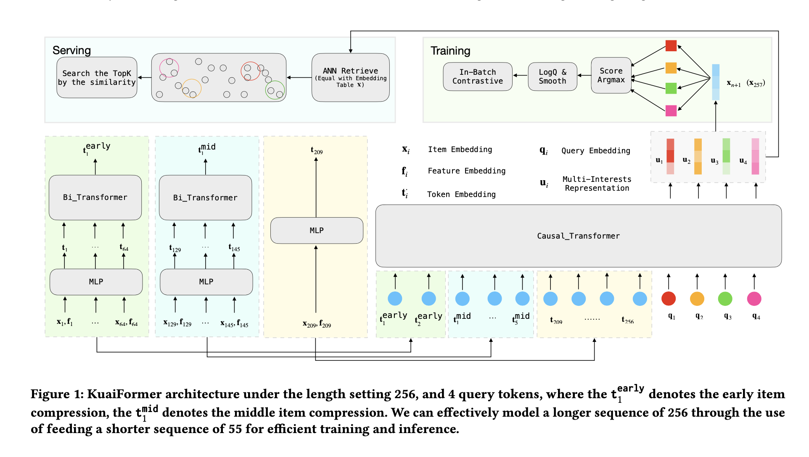
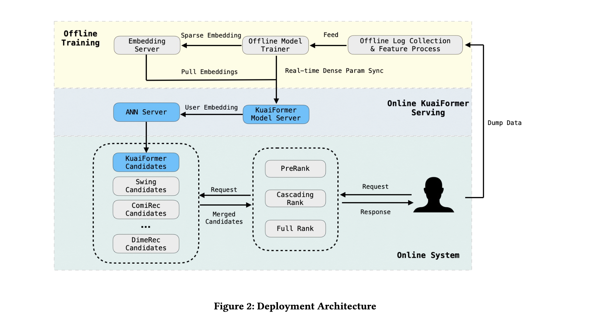
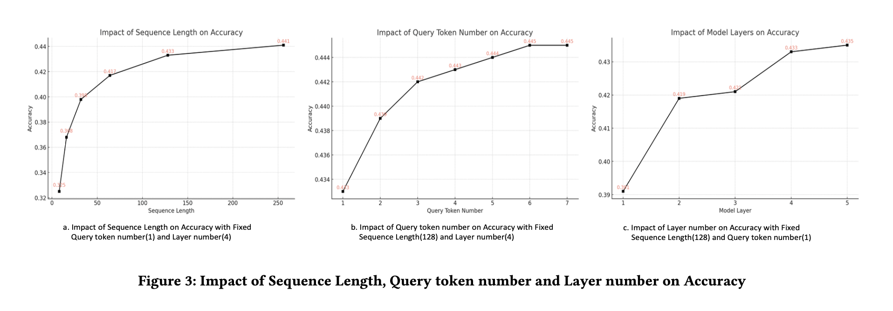

## KuaiFormer：快手基于Transformer的检索模型
刘驰  
快手科技 北京，中国  
liuchi05@kuaishou.com  

曹江霞  
快手科技 北京，中国  
caojiangxia@kuaishou.com  

黄锐  
快手科技 北京，中国  
huangrui06@kuaishou.com  

郑凯  
快手科技 北京，中国  
zhengkai@kuaishou.com  

罗强  
快手科技 北京，中国  
luoqiang@kuaishou.com  

盖坤  
无所属机构 北京，中国  
gai.kun@qq.com  

周国瑞  
快手科技 北京，中国  
zhouguorui@kuaishou.com  

arXiv:2411.10057v1 [cs.IR] 2024年11月15日  

## 摘要
在大规模内容推荐系统中，检索作为流程的初始阶段，负责从数十亿个选项中筛选出数千个候选物品传递给排序模块。传统上，主流的检索方法是基于深度神经网络（DNN）双塔结构的嵌入检索（EBR）。然而，将Transformer应用于检索任务已成为近期研究的焦点，尽管实际工业部署仍面临重大挑战。本文提出KuaiFormer，一种部署在大规模内容推荐系统中的新型Transformer-based检索框架。KuaiFormer从根本上重新定义了检索流程，将传统的分数估计任务（如点击率预测）转变为Transformer驱动的下一行为预测范式。这一转变实现了更有效的实时兴趣获取和多兴趣提取，显著提升了检索性能。自2024年5月起，KuaiFormer已成功集成到快手App的短视频推荐系统中，服务超过4亿日活跃用户，并使快手用户的平均每日使用时长显著增加。我们从技术和业务两方面分享了在大规模推荐系统中部署Transformer的经验，解决了工业实现过程中遇到的实际挑战。研究结果为旨在利用Transformer模型优化大规模内容推荐系统的工程师和研究人员提供了宝贵指导。

### CCS概念
• 信息系统 ￫ 推荐系统  

### 关键词
短视频推荐；Transformer；用户兴趣建模  

## 1 引言
Transformer[32]架构已在多个领域取得显著成功，例如自然语言处理（NLP）中的BERT[7]和GPT[1, 3]，以及计算机视觉（CV）中的视觉Transformer[2, 19, 23]。这些成就凸显了Transformer在序列建模和并行化方面的卓越能力。在推荐系统领域，基于Transformer的架构（如SASRec[14]和Bert4Rec[29]）也展现出潜力。然而，这些学术研究往往未能解决某些工业界挑战，限制了它们在快手等大规模推荐系统中推动业务成功的有效性。

短视频推荐面临独特挑战，需要先进的建模技术。短视频内容的多样性和用户兴趣的快速演变要求模型实时适应，以准确捕捉这些动态偏好。用户每天通常观看数百个短视频，在广泛的兴趣领域表达偏好，而系统则主动推送多样化内容以减轻审美疲劳并避免“过滤气泡”效应。因此，依赖每日更新的模型（如PinnerFormer[25]）难以适应用户不断变化的内容需求。此外，SASRec和Bert4Rec等传统方法将用户行为压缩为单一兴趣向量，缺乏准确捕捉这些交互中反映的全部用户兴趣的能力。

为更有效地捕捉复杂用户兴趣，MIND[18]和ComiRec[4]等模型采用胶囊网络等技术从用户行为序列中提取多个兴趣向量。然而，由于这些模型未采用原生Transformer架构，无法充分利用Transformer带来的优势。此外，它们未解决长序列处理相关的性能开销问题，这在工业应用中是一个重要关注点。

为在快手大规模短视频推荐系统中有效部署Transformer模型，本研究详细分析了推荐领域的这些特定挑战，并提出了一系列简洁有效的针对性解决方案。

### 核心挑战
1. **如何在十亿级物品集上训练**：
大型语言模型（LLMs）通常采用下一个token预测作为预训练任务。这涉及根据历史序列计算词汇表中所有token作为下一个token的概率，并选择概率最高的token作为预测结果。通用语言模型的词汇表通常包含不到10万个token[30]。而在快手短视频推荐系统中，候选池包含数十亿个短视频，使用朴素softmax方法计算所有候选物品的概率在计算上不可行。因此，需要高效方法来解决大规模候选选择的挑战，同时保持模型性能。

2. **如何捕捉用户的多兴趣**：
与预测下一个token时具有明确语义方向的语言不同，在短视频服务中，用户通常有多个兴趣点，且对短视频观看的容忍度更高。因此，可能存在多个语义完全不同的短视频同时作为“正例”下一个物品，这对标准Transformer学习不利。

3. **如何在较少计算资源下扩展到更长序列**：
与大型语言模型可以堆叠更深更宽的Transformer以利用极高计算资源实现最佳性能不同，作为推荐模型，我们需要处理大量请求（每天约500亿次以上），因此检索模型必须在效率和效果之间取得平衡。特别是，Transformer的时间复杂度为\(O(n^2d)\)，其中n表示输入序列长度，d表示隐藏状态维度[15]。因此，基于Transformer的模型对序列长度敏感，需要设计特定模块来加速长序列训练。

### 本文贡献
本研究提出KuaiFormer，这是我们在实时工业检索方面的最新进展，也是过去一年快手检索阶段最显著的改进。具体而言，我们引入了几项可靠的修改，使Transformer适应工业检索场景：用于稳定模型训练的定制softmax学习目标、用于捕捉用户多样化兴趣的多个查询token，以及用于提高长序列建模效率的历史序列压缩机制。

1. **带LogQ校正的平滑批内Softmax损失**：
为避免直接在十亿级物品集上训练，我们首先采用批内softmax作为KuaiFormer的学习目标。然而，批内softmax不可避免地引入采样偏差，偏离均匀物品采样：热门物品更有可能被选为负样本，这会导致性能下降。我们应用广泛使用的LogQ校正方法[35]来修正采样偏差。此外，在短视频服务中，用户对观看内容的容忍度通常更高，这降低了批内采样中的负样本真正代表用户不喜欢物品的可信度。因此，我们不使用严格的0/1标签进行训练，而是引入标签平滑技术[24]来减轻训练噪声并增强模型鲁棒性。

2. **多兴趣查询Token**：
为捕捉用户的多样化兴趣，我们从BERT中的[CLS]token获得灵感——该token引入可学习token，将原始输入信息压缩为整体序列表征。我们在KuaiFormer中扩展了这一概念，引入多个可学习token，并结合多兴趣训练策略，从历史物品序列中提取不同的用户兴趣表征。具体而言，KuaiFormer的可学习查询token利用因果掩码机制，使后续兴趣token能够与先前的兴趣token表征充分交互，从而实现更有效的兴趣解耦。

3. **自适应物品压缩机制**：
为解决长序列建模的效率挑战，我们提出一个直观假设：与最近观看的短视频相比，用户对早期视频的记忆更为模糊。因此，我们可以对早期物品进行粗粒度建模，而对最新物品进行细粒度建模。基于此，我们设计了自适应物品压缩机制：首先将早期物品序列分为若干组，将每组压缩为单一表征以减少输入序列长度；然后将这一系列压缩表征与最新物品拼接，形成模型的token序列输入。

本文的主要贡献如下：
- 提出下一代检索方法KuaiFormer，据我们所知，这是首个在工业级推荐系统中采用纯Transformer架构的实时检索模型；
- 进行了大量离线和在线实验，证明KuaiFormer的优越性，为快手短视频服务带来了+0.360%/+0.126%/+0.411%的在线视频观看时长提升；
- 从模型和架构两方面提供见解，解决了工业推荐系统部署中遇到的实际挑战；
- 我们的经验为旨在利用Transformer构建更好工业推荐系统的工程师和研究人员提供了宝贵指导。

## 2 方法
本节描述KuaiFormer在推荐系统中的工作原理。首先简要解释KuaiFormer在训练和推理中的问题定义；然后介绍KuaiFormer的基本工作流程，包括特征工程和模型架构；接下来详细说明如何建模更长序列和捕捉用户多兴趣；最后给出在十亿级物品集上实现稳定训练的损失函数。

### 2.1 问题定义
在一般推荐任务中，我们利用用户的历史观看物品建模其兴趣，并预测他们可能接下来观看的视频。

对于每个用户，设\({(x_{1}, f_{1}),(x_{2}, f_{2}), ...,(x_{n}, f_{n})}\)表示其按时间顺序排列的近期正例观看短视频信息，其中\(x_{i} \in \mathbb{R}\)表示来自整个短视频集X的短视频ID，\(f_{i} \in \mathbb{R}^{|F|}\)表示根据属性集F得到的观看辅助信息。通常，我们手工设计约10+个短视频观看属性用于兴趣建模，包括观看时间、交互标签（如点赞、评论）、短视频时长、多模态类别标签ID等。

根据序列\({(x_{1}, f_{1}),(x_{2}, f_{2}), ...,(x_{n}, f_{n})}\)，在训练过程中，由于已知下一个物品\(x_{n+1}\)，我们可以最大化以下似然以捕捉用户的实时兴趣：
\[
\begin{cases} 
\{ u_{1},... ,u_{k}\} =model(\{ (x_{1},f_{1}),(x_{2},f_{2}),... ,(x_{n},f_{n})\} ),\\ 
\arg\max_{x_{n+1}\in \mathcal {X}}P\left( x_{n+1}|\left\{ u_{1},... ,u_{k}\right\} \right) 
\end{cases} \tag{1}
\]
其中\(P(\cdot) \in \mathbb{R}^{|X|}\)是候选物品在X中的概率，u表示用户兴趣表征。

在推理时，作为检索模型，我们的目标是找到一小组与用户实时兴趣相关的候选物品：
\[
\left\{\hat{x}_{n+1}^{1}, \hat{x}_{n+1}^{2}, ...\right\}=ANN\left(\left\{u_{1}, ..., u_{k}\right\}, \mathcal{X}\right) \tag{2}
\]
其中ANN(·)表示近似最近邻技术，是一种快速搜索系统（如faiss[13]），用于根据用户兴趣表征u找到候选物品。\({\hat{x}_{n+1}^{1}, \hat{x}_{n+1}^{2}, ...}\)表示相关性最高的数百个物品。

### 2.2 基础骨干网络
本节介绍KuaiFormer的基础骨干网络，包括短视频嵌入模块和堆叠Transformer模块。

#### 2.2.1 嵌入模块
在嵌入映射阶段，我们利用两种嵌入层考虑不同类型的属性，形成模型输入：

1. **独热离散属性嵌入层**：
作为最常见的嵌入层类型，主要用于建模离散特征，包括短视频ID、标签ID、交互标签等。以短视频ID映射阶段为例，我们分配一个参数矩阵\(X \in \mathbb{R}^{|X| ×d}\)存储其嵌入，其中d是嵌入维度。因此，对于任意短视频ID\(x_{i}\)，我们可以通过直接查找操作轻松获得相应的嵌入\(x_{i} \in \mathbb{R}^{d}\)：
\[x_{i}=LookUp(X,x_{i}) \tag{3}\]

2. **分桶连续属性嵌入层**：
与离散属性不同，该层旨在嵌入连续属性，包括观看时间、短视频时长等。对于这些连续属性，由于其先验分布不同，我们实际上为每个属性定制设计了特殊的分桶策略，在保留分布特征的同时将其离散化。以短视频时长\(f_{i}^{dura }\)为例，我们采用均匀分桶策略将其分为1000个桶，最大时长为300秒，并从参数矩阵\(Fduration \in \mathbb{R}^{1000 ×d}\)中查找其嵌入：
\[f_{i}^{bucket_dura }=int\left(\frac{min \left(f_{i}^{dura }, 300\right)}{300} * 1000\right) \tag{4}\]
其中\(f_{i}^{bucket_dura }\)是表示连续属性\(f_{i}^{dura }\)映射离散ID索引的整数。

#### 2.2.2 Transformer模块
在上述嵌入模块之上，我们首先利用它们形成观看短视频序列信息。对于每个信息\((x_{i}, f_{i})\)，我们可以将其映射为：
\[t_{i}=MLP([x_{i},f_{i}]) \tag{5}\]
其中\(MLP(\cdot) \in \mathbb{R}^{d ×d}\)是前馈神经网络，\([\cdot, \cdot]\)表示拼接操作，\(t_{i}\)是最终的单元token表征。类似地，我们可以将输入表征序列转换为\({t_{1}, t_{2}, ..., t_{n}}\)。

之后，我们利用Transformer对输入序列进行建模，以提取用户兴趣表征。具体而言，我们采用Llama Transformer架构[31]作为骨干网络，主要包括：(1) RMS归一化技术，避免梯度消失/爆炸问题；(2) 多头掩码自注意力机制，捕捉复杂的token依赖关系；(3) 逐点前馈层，增强模型的非线性能力。
\[u= Causal_Transformer \left(\left\{t_{1}, t_{2}, ..., t_{n}\right\}, L, M\right) \tag{6}\]
如图所示，u是顶层最后一个位置的输出，L是控制Transformer深度的超参数，M是多头注意力的头数。

### 2.3 长序列建模
实际上，生成的表征u可以支持训练阶段（式1）和推理阶段（式2）。然而，我们需要在几毫秒内处理大量请求，峰值时每秒需处理超过10万个请求。因此，直接扩展到更长的输入序列以提供高质量的训练和推理表征是难以实现的。在实验中，我们发现当序列长度n从64扩展到256时，相应的计算资源增加了6倍，这是不可接受的。因此，一个挑战性问题是：如何在较少计算资源下建模更长序列？

对于用户而言，最近观看的视频留下的印象更深刻，而较早的浏览历史则相对模糊。这一观察启发我们压缩较早观看的短视频，以减少序列长度。在KuaiFormer中，我们设计了一种简单有效的自适应物品压缩机制，分为三个步骤：

1. 首先根据位置将输入序列分为三部分：早期部分、中间部分和最新部分。对于早期部分和中间部分，我们分别将64个相邻物品和16个相邻物品合并为一个组。

2. 对于早期/中间物品组，我们利用无掩码策略的单层双向Transformer将其聚合为一个组物品表征。以早期物品组为例，该过程可表示为：
\[
\begin{aligned} 
t_{1}^{early } & =Mean\left(Bi \_Transformer \left(\left\{t_{1}, ..., t_{64}\right\}, M\right)\right) \\ 
t_{2}^{early } & =Mean\left(Bi \_Transformer \left(\left\{t_{65}, ..., t_{128}\right\}, M\right)\right) \\ 
t_{1}^{mid } & =Mean\left(Bi \_Transformer \left(\left\{t_{129}, ..., t_{144}\right\}, M\right)\right) \\ 
& ... \\ 
t_{5}^{mid } & =Mean\left(Bi \_Transformer \left(\left\{t_{193}, ..., t_{208}\right\}, M\right)\right) 
\end{aligned}
\]
类似地，中间物品组的计算也遵循此逻辑，得到结果\(t_{i}^{mid }\)。

3. 最后，我们用压缩后的物品序列替代原始输入，生成用户兴趣：
\[
\begin{aligned} 
u= Causal\_{Transformer} ( & \left\{t_{1}^{early }, t_{2}^{early }\right\} \\ 
& \oplus\left\{t_{1}^{mid }, ..., t_{5}^{mid }\right\} \\ 
& \left.\oplus\left\{t_{209}, ..., t_{256}\right\}, L, M\right) 
\end{aligned} \tag{7}
\]
基于自适应物品压缩策略，将序列长度从64扩展到256时，我们的模型仅增加了10%的额外计算资源。

### 2.4 多兴趣建模
此外，在短视频服务中，用户通常有多个兴趣点，因此使用单一表征难以表达用户复杂的实时动态兴趣。对于序列建模，随着序列长度增加，捕捉序列中嵌入的多样化兴趣变得越来越重要。在KuaiFormer中，我们也探索了类似挑战：如何在Transformer范式中建模用户的多兴趣？

受BERT中特殊“[CLS]”token成功的启发——该token引入可学习token以汇总输入序列信息用于下游任务——我们考虑采用k个不同的特殊token作为查询token，以提取不同的用户兴趣。
\[
\begin{aligned} 
\left\{u_{1}, ..., u_{k}\right\}= Causal\_Transformer \left( \& \left\{t_{1}^{early }, t_{2}^{early }\right\}\right. \\ 
& \oplus\left\{t_{1}^{mid }, ..., t_{5}^{mid }\right\} \\ 
& \oplus\left\{t_{209}, ..., t_{256}\right\} \\ 
& \left.\oplus\left\{q_{1}, ..., q_{k}\right\}, L, M\right) 
\end{aligned} \tag{8}
\]
其中\({q_{1}, ..., q_{k}}\)是k个不同的用户兴趣查询token，它们与物品压缩序列拼接。\({u_{1}, ..., u_{k}}\)是最终的用户兴趣表征，以适应用户动态行为。值得注意的是，在先前的检索方法中，其多个兴趣表征是独立学习的，彼此不可见。而在KuaiFormer中，我们的查询token遵循自回归范式，允许后续兴趣token与先前的兴趣token表征充分交互，以实现更好的兴趣解耦。

在多兴趣表征下，我们利用argmax函数计算预测分数。例如，给定下一个正例短视频\(x_{n+1}\)，我们将该过程表示为：
\[
\begin{cases} 
\mathbb {P}(x_{n+1}|\left\{ u_{1},... ,u_{k}\right\} )=\frac {Score_{x_{n+1}}}{\sum _{x}^{\mathcal {X}}Score_{x}}, \\ 
Score_{x_{n+1}}=\argmax\left( \left\{ x_{n+1}^{\top }u_{1},...,x_{n+1}^{\top }u_{k}\right\} \right) 
\end{cases} \tag{9}
\]
其中预测分数从最高相关性的兴趣表征中选择。

### 2.5 稳定训练
到目前为止，我们已经介绍了生成更长序列的多个用户兴趣表征的学习过程。本节将深入探讨损失函数设计，以解决最具挑战性的问题：如何在十亿级物品集上训练基于Transformer的模型。

通常，基于Transformer的模型采用softmax函数训练，以最大化下一个正例token的概率，同时最小化所有其他token的概率。然而，在推荐任务中，直接在完整的十亿级物品集上训练模型是不切实际的，因此我们首先采用批内softmax作为KuaiFormer的学习目标：
\[
\mathcal{L}\left(x_{n+1}\right)=-\log \left(\frac{e^{Score_{x_{n+1}}}}{e^{Score_{x_{n+1}}}+\sum_{\tilde{x}_{n+1}}^{\mathcal{B}} e^{Score_{\tilde{x}_{n+1}}}}\right) \tag{10}
\]
其中\(\mathcal{B}\)表示批内负例短视频集，\(x_{n+1}\)表示正例物品，\(\tilde{x}_{n+1}\)表示任意负例物品。

然而，批内softmax不可避免地引入采样偏差，偏离均匀物品采样：热门物品更有可能成为负例样本，这将不可避免地导致模型性能下降。因此，我们采用广泛使用的LogQ校正方法[35]来优化物品采样概率，实现平衡的批内softmax：
\[
\begin{aligned} 
\mathcal{L}_{log Q} & =-\log \left(Score_{x_{n+1}}^{log Q}\right) \\ 
& =-\log \left(\frac{e^{Score_{x_{n+1}}-\log \left(Q_{u}\left(x_{n+1}\right)\right)}}{e^{Score_{x_{n+1}}-\log \left(Q_{u}\left(x_{n+1}\right)\right)}+\sum_{\tilde{x}_{n+1} \in \mathcal{B}} e^{Score_{\tilde{x}_{n+1}}-\log \left(Q_{u}\left(\tilde{x}_{n+1}\right)\right)}}\right) 
\end{aligned} \tag{11}
\]

在短视频服务中，用户倾向于对观看各种内容有更高的容忍度，因此难以将下一个物品明确归类为“正例”或“负例”。因此，我们避免使用严格的二元（0/1）标签进行模型训练。相反，我们采用平滑技术来减轻训练噪声并提高内容标签的可靠性[24]：
\[
\mathcal{L}_{log Q}^{smooth }=
\begin{cases} 
-(1-\alpha) \log \left(Score_{x_{n+1}}^{log Q}\right) \\ 
\sum_{\tilde{x}_{n+1}}^{\mathcal{B}}-\frac{\alpha}{|\mathcal{B}|} \log \left(1 - Score_{\tilde{x}_{n+1}}^{log Q}\right) 
\end{cases}
\]
其中\(\mathcal{L}_{log Q}^{smooth }\)是KuaiFormer的最终训练目标，α是用于控制平滑效果的超参数。模型训练收敛后，我们利用ANN技术在式(2)中为每个用户推荐请求搜索Top-K短视频。整体训练和服务流程如图1所示。

## 3 部署架构
本节将介绍KuaiFormer在工业流式视频推荐系统中的综合部署架构，该系统服务于快手最大的推荐场景检索阶段。KuaiFormer持续接收在线数据进行训练，并以分钟级频率将参数更新到在线模型服务。

如图2所示，KuaiFormer检索模型在工业级定制的分布式训练框架上以在线学习方式进行训练。短视频内容推荐系统每天响应数亿用户的请求。用户请求首先经过检索系统——该系统由多个独立检索通道组成，如经典的Swing[34]、GNN[9]、ComiRec[4]、DimeRec[21]、GPRP[36]等。KuaiFormer作为新的检索通道被引入检索系统。所有检索通道的检索候选物品在发送到排序系统之前会进行聚合和去重。在我们的系统中，首先通过预排序阶段进行初步粗粒度排序，然后是级联排序阶段，最后是细粒度全排序阶段，以获得呈现给用户的最终短视频集。离线日志系统记录实时用户反馈，包括观看时长等密集反馈信号以及点赞、关注、分享等相对稀疏的交互。所有离线日志都被处理为训练记录并聚合传输到离线训练框架。为提高系统效率，我们使用专用嵌入服务器存储稀疏嵌入，而较少的密集模型参数则定期传输到在线系统，用于实时推断用户嵌入。最终检索结果通过高效的ANN检索算法（如Faiss[13]、ScaNN[8]）获得。在实践中，我们采用GPU暴力搜索方法检索Top-K候选物品。

## 4 实验
本节通过详细分析回答以下主要研究问题（RQs）：
1. RQ1：与性能强劲的检索方法相比，KuaiFormer是否实现了当前最优（SOTA）离线性能？
2. RQ2：KuaiFormer是否为短视频服务带来了显著的在线收益？
3. RQ3：不同超参数设置如何影响KuaiFormer性能？

### 4.1 实验设置
#### 4.1.1 数据集
我们在快手最大的推荐场景——短视频数据流上进行实验，该场景每天包含超过4亿用户和500亿条日志。

#### 4.1.2 评估指标
为评估性能，我们采用两种指标与基线模型和我们的模型变体进行比较：在线命中率和离线准确率。

- **在线命中率**：为公平比较不同方法，我们利用用户的在线请求结果评估不同模型的能力。具体而言，计算模型推荐结果与用户实际观看物品之间的命中率，例如观看物品是否在Top 50/100/500/1000检索结果中。

- **离线准确率**：为评估KuaiFormer变体的性能，由于模型在批内设置中训练，并使用在线学习不断整合最新日志，相同批次大小下训练损失稳定时的准确率可以评估模型的拟合能力。这种离线训练准确率反映了模型拟合用户行为的能力。

#### 4.1.3 基线模型
在快手短视频推荐场景中，同时部署了多个检索模型，以最大化内容供应的多样性并满足用户需求。我们将KuaiFormer与快手部署的以下代表性强检索方法进行比较：(1) 基于Item2Item的方法：Swing[34]；(2) 基于多兴趣的方法：ComiRec[4]；(3) 基于图的方法：GNN[9]；(4) 基于扩散的方法：DimeRec[21]；(5) 基于列表的方法：GPRP[36]。此外，为公平比较，我们还实现了SASRec，尽管它尚未在快手实现在线收益[4]。

### 4.2 性能比较（RQ1）
为准确评估检索模型的离线覆盖率，我们重放真实在线请求并调用这些模型，每个模型返回50-1000个结果。模型推荐结果与用户实际观看内容之间的命中率如表1所示。根据结果，我们有以下观察：(1) 经典序列建模方法SASRec的命中率表现不佳，表明KuaiFormer中的多兴趣模块有助于覆盖更广泛的用户兴趣；(2) 与著名的多兴趣方法ComiRec[4]相比，KuaiFormer在所有指标上均表现出持续改进，验证了使用Transformer作为基础编码器提取用户偏好的有效性；(3) 由于GPRP使用从检索到排序阶段的推荐漏斗数据进行训练，在100-1000的检索数量范围内，其命中率高于其他传统方法。然而，KuaiFormer的命中率比GPRP提高了25%以上。这表明，即使未明确整合推荐漏斗数据，下一行为预测建模方法也能更好地拟合训练集。

表1：离线性能比较（%），从次优到最优的提升幅度

| 指标 | GPRP | SASRec | DimeRec | ComiRec | Swing | GNN | KuaiFormer | 相对次优提升 |
| --- | --- | --- | --- | --- | --- | --- | --- | --- |
| HR@50 | 3.57% | 1.17% | 1.54% | 0.95% | 0.14% | 3.97% | 4.21% | 6.05% |
| HR@100 | 5.21% | 2.51% | 2.49% | 1.93% | 0.29% | 4.60% | 6.58% | 26.30% |
| HR@500 | 11.31% | 5.37% | 6.99% | 7.02% | 1.54% | 8.89% | 15.61% | 38.12% |
| HR@1000 | 15.70% | 7.22% | 9.17% | 10.06% | 2.03% | 10.26% | 19.88% | 26.62% |

### 4.3 在线A/B测试（RQ2）
为精确衡量KuaiFormer对短视频服务的改进，我们在快手三个最大场景（快手单页/双页和快手极速版单页）中，对10%的用户进行了为期一周的全面A/B测试。表2展示了KuaiFormer的观看时长和交互指标。由于不同场景的优先级不同，双页场景省略了某些指标，但保留了最关键的视频观看时长指标以确保核心洞察的可获取性。值得注意的是，视频观看时长约0.1%的提升是具有统计显著性的变化，能够带来令人满意的收益——因为我们的平台每天有4亿活跃用户。根据表2，KuaiFormer在三个最大场景中实现了+0.360%、+0.126%、+0.411%的视频观看时长提升，这是2024年快手最显著的检索实验之一。KuaiFormer在参与度指标（如点赞、关注和评论）方面也表现出显著提升。这表明KuaiFormer有效适应了不断变化的用户需求，准确捕捉用户兴趣并推荐相关内容，从而提高了用户参与度和满意度。此外，衡量模型帮助用户发现新兴趣能力的“新奇惊喜”指标也有所改善，这表明多兴趣机制既能捕捉主流兴趣，也能捕捉小众兴趣，引导用户接触新的兴趣领域。

表2：快手短视频服务的在线A/B测试结果

| 应用场景 | 视频观看时长 | 应用总使用时长 | 人均使用时长 | 单视频平均观看时长 | 视频播放量 | 点赞 | 关注 | 评论 | 新奇惊喜 |
| --- | --- | --- | --- | --- | --- | --- | --- | --- | --- |
| 快手单页 | +0.360% | +0.184% | +0.157% | +0.265% | +0.095% | +0.256% | +0.600% | +0.553% | +0.235% |
| 快手极速版单页 | +0.126% | +0.127% | +0.107% | +0.060% | +0.158% | +0.286% | +0.222% | +0.062% | +0.181% |
| 快手双页 | +0.411% | – | – | – | – | +0.399% | +1.254% | +1.463% | – |

### 4.4 超参数影响（RQ3）
本节探讨KuaiFormer中四个超参数的影响：序列长度、查询token数、层数和物品压缩机制。

#### 4.4.1 序列长度影响
如表3(a)所示，将序列长度从8增加到256，准确率从0.325稳步提升到0.441。这表明增加序列长度使模型能够捕捉更多上下文，从而提高性能。然而，随着序列长度增加，提升速率下降，表明边际收益递减。虽然准确率持续增加，但序列长度加倍带来的收益变小，尤其是序列长度超过64后。

#### 4.4.2 查询token数影响
表3(b)的数据揭示了查询token数与模型准确率之间的明确关系。随着token数增加，准确率持续提升，表明额外的token为模型提供了更多上下文，有助于更好的预测。然而，随着token数增加，提升速率下降，表明边际收益递减。每个额外token带来的准确率提升变小，意味着模型可能达到饱和点，超过该点后进一步增加token对整体性能的贡献不大。例如，从1个token增加到2个token时准确率提升0.006，而从6个token增加到7个token时仅提升0.001，这表明在一定数量的token后，添加更多token的收益变得微乎其微。

由于我们为每个查询token检索一定数量的视频，然后统一排序并截断到固定数量，过多的查询token将导致每个token检索到的视频数量减少。此外，过多的查询token会增加计算资源消耗，因此查询token数不能无限增加。在本实验中，6个token似乎是最佳平衡点，此时准确率提升开始趋于平稳，无需为获得实质性改进而进一步增加token数。

#### 4.4.3 层数影响
表3(c)展示了在固定序列长度和查询token数的情况下，增加模型层数对准确率的影响。结果显示，当层数从1增加到5时，准确率持续提升。

从第1层（0.391）到第2层（0.419）的准确率提升显著，表明额外的层有助于更精细的特征提取和更好的模型性能。然而，与查询token的影响类似，每增加一层，提升幅度都会减小。例如，从第4层（0.433）到第5层（0.435）仅提升0.002，表明在达到一定深度后，模型进入边际收益递减阶段，增加更多层仅带来微小收益。

这种模式表明，虽然更深的模型通常表现更好，但在复杂性和性能之间存在权衡。超过一定深度（本实验中约为第4层或第5层），准确率提升变得微乎其微，额外的层可能不值得增加的计算成本。因此，在这种情况下，第4层或第5层似乎是最佳深度，平衡了准确率和效率。

#### 4.4.4 物品压缩策略影响
表3比较了不同序列长度和压缩策略的模型性能。具体而言，我们探索了物品序列压缩对模型准确率的影响。

对于压缩方法，我们设计了一种策略：从最早到最新，以64、64、16、16、16、16、16个物品的压缩窗口大小逐步压缩256个物品的序列。最新的48个物品不进行压缩，直接附加到该序列后，然后将得到的序列输入模型。查询token数固定为1，模型架构包含4层Transformer。

我们的发现表明，压缩序列的性能优于序列长度为64的模型，并且值得注意的是，其准确率略高于序列长度为256的完整未压缩序列模型。这表明压缩策略有效减少了序列中的噪声，有助于提高模型性能。

表3：不同序列长度和压缩策略的模型性能比较

| 修改项 | 准确率 |
| --- | --- |
| 原始序列长度64，无压缩 | 0.417 |
| 原始序列长度256，无压缩 | 0.441 |
| 原始序列长度256，有压缩 | 0.445 |

## 5 相关工作
### 5.1 序列推荐
在推荐系统中，推荐流程通常分为两个关键阶段：检索和排序。检索阶段旨在从大型候选池中高效检索用户可能感兴趣的子集物品。由于计算限制，检索模型通常设计为更轻量的架构，常采用双塔结构——分别建模用户和物品的塔，仅在顶层交互[6, 11]。相比之下，排序阶段对检索到的子集进行评分，允许应用更复杂的模型和复杂的特征交互[5, 26, 37, 38]。本工作的重点是设计更有效的检索模型。

历史上，协同过滤方法已广泛应用于推荐任务，包括基于物品的CF、基于用户的CF和因子分解机[10, 16, 17]。随着深度学习的发展，DNN和基于嵌入的检索等模型变得普遍[6, 11, 12, 20]。在推荐领域，利用用户的历史行为至关重要。基于用户行为序列预测用户可能接下来交互的物品被称为序列建模[22, 28, 33]。

已有多项工作采用Transformer架构进行序列建模。例如，SASRec将推荐任务建模为自回归问题，基于先前的交互预测序列中的下一个物品[14]。相比之下，Bert4Rec利用双向自注意力机制捕捉序列中的过去和未来上下文，增强模型对用户行为的理解[29]。在实际工业场景中部署的PinnerFormer利用Transformer架构捕捉用户的长期兴趣用于推荐[25]。

这些基于Transformer的模型在捕捉复杂用户行为模式方面表现出显著改进，从而提高了推荐系统的有效性。

### 5.2 多兴趣用户表征
在推荐系统中，用户通常表现出多样化的兴趣，需要提供多样化的内容来满足他们的多方面偏好。传统模型通常用单一向量表示用户兴趣，可能无法充分捕捉用户行为的复杂性。为解决这一限制，已开发出多种方法来建模用户的多兴趣，特别是在检索阶段。MIND模型为每个用户分配固定数量的向量，表示对不同内容类型的偏好[18]。它采用胶囊网络的动态路由机制，从用户行为序列中提取多个兴趣表征，从而更有效地捕捉多样化的用户兴趣。在MIND的基础上，ComiRec模型探索了整合多兴趣检索结果的方法[4]。ComiRec引入了可控聚合模块，旨在平衡推荐准确率和多样性。此外，它还结合了基于动态路由和自注意力机制的多兴趣提取模块，以更好地捕捉用户的多兴趣。MIP利用时间感知自注意力机制从用户行为序列中提取多个兴趣表征[27]。通过整合时间信息，MIP更准确地捕捉用户兴趣的动态演变，从而提高推荐性能。

## 6 结论
KuaiFormer证明了基于Transformer的架构在短视频推荐系统大规模检索任务中的可行性和有效性。通过利用多兴趣提取、自适应序列压缩和稳定训练技术，KuaiFormer有效捕捉了用户复杂的动态兴趣，并能高效扩展到数十亿次请求。我们广泛的离线和在线评估证实，KuaiFormer在离线命中率和在线A/B测试中均取得了显著改进，验证了其提升用户满意度和业务性能的能力。本工作强调了先进神经架构在工业推荐系统中的变革潜力，提供了一个可扩展的框架，可为内容检索和推荐领域的进一步创新提供启发。

## 参考文献
[1] Josh Achiam, Steven Adler, Sandhini Agarwal, Lama Ahmad, Ilge Akkaya, Florencia Leoni Aleman, Diogo Almeida, Janko Altenschmidt, Sam Altman, Shyamal Anadkat, et al. 2023. GPT-4技术报告.

[2] Dosovitskiy Alexey. 2020. 一张图片值16x16个词：用于大规模图像识别的Transformer. arXiv.

[3] Tom B Brown. 2020. 语言模型是少样本学习者. arXiv.

[4] Yukuo Cen, Jianwei Zhang, Xu Zou, Chang Zhou, Hongxia Yang, and Jie Tang. 2020. 可控多兴趣推荐框架. 《ACM SIGKDD知识发现与数据挖掘会议论文集》(KDD). 2942-2951.

[5] Jianxin Chang, Chenbin Zhang, Yiqun Hui, Dewei Leng, Yanan Niu, Yang Song, and Kun Gai. 2023. Pepnet：注入个性化先验信息的参数和嵌入个性化网络. 《ACM SIGKDD知识发现与数据挖掘会议论文集》(KDD).

[6] Paul Covington, Jay Adams, and Emre Sargin. 2016. 用于YouTube推荐的深度神经网络. 《ACM推荐系统会议论文集》(RecSys).

[7] Jacob Devlin, Ming-Wei Chang, Kenton Lee, and Kristina Toutanova. 2019. BERT：用于语言理解的深度双向Transformer预训练. 《NAACL会议论文集》, Jill Burstein, Christy Doran, 和 Thamar Solorio（编）.

[8] Ruiqi Guo, Philip Sun, Erik Lindgren, Quan Geng, David Simcha, Felix Chern, and Sanjiv Kumar. 2020. 利用各向异性向量量化加速大规模推理. 《国际机器学习会议论文集》. PMLR, 3887-3896.

[9] Xiangnan He, Kuan Deng, Xiang Wang, Yan Li, Yongdong Zhang, and Meng Wang. 2020. LightGCN：简化并增强推荐系统中的图卷积网络. 《国际ACM SIGIR信息检索研究与发展会议论文集》(SIGIR).

[10] Jonathan L Herlocker, Joseph A Konstan, and John Riedl. 2000. 解释协同过滤推荐. 《ACM计算机支持的协同工作会议论文集》.

[11] Jui-Ting Huang, Ashish Sharma, Shuying Sun, Li Xia, David Zhang, Philip Pronin, Janani Padmanabhan, Giuseppe Ottaviano, and Linjun Yang. 2020. Facebook搜索中的基于嵌入的检索. 《ACM SIGKDD知识发现与数据挖掘会议论文集》(KDD).

[12] Po-Sen Huang, Xiaodong He, Jianfeng Gao, Li Deng, Alex Acero, and Larry Heck. 2013. 利用点击数据学习深度结构化语义模型用于网络搜索. 《ACM国际信息与知识管理会议论文集》(CIKM).

[13] Jeff Johnson, Matthijs Douze, and Hervé Jégou. 2019. 基于GPU的十亿级相似度搜索. 《IEEE大数据汇刊》.

[14] Wang-Cheng Kang and Julian McAuley. 2018. 自注意力序列推荐. 《IEEE国际数据挖掘会议论文集》(ICDM).

[15] Feyza Duman Keles, Pruthuvi Mahesakya Wijewardena, and Chinmay Hegde. 2022. 自注意力的计算复杂度研究. arXiv.

[16] Hyeyoung Ko, Suyeon Lee, Yoonseo Park, and Anna Choi. 2022. 推荐系统综述：推荐模型、技术和应用领域. 《电子学》(2022).

[17] Yehuda Koren, Steffen Rendle, and Robert Bell. 2021. 协同过滤的进展. 《推荐系统手册》(2021).

[18] Chao Li, Zhiyuan Liu, Mengmeng Wu, Yuchi Xu, Huan Zhao, Pipei Huang, Guoliang Kang, Qiwei Chen, Wei Li, and Dik Lun Lee. 2019. 用于天猫推荐的动态路由多兴趣网络. 《ACM国际信息与知识管理会议论文集》(CIKM).

[19] Junnan Li, Dongxu Li, Caiming Xiong, and Steven Hoi. 2022. Blip：用于统一视觉-语言理解和生成的语言-图像预训练引导. 《国际机器学习会议论文集》.

[20] Sen Li, Fuyu Lv, Taiwei Jin, Guli Lin, Keping Yang, Xiaoyi Zeng, Xiao-Ming Wu, and Qianli Ma. 2021. 淘宝搜索中基于嵌入的商品检索. 《ACM SIGKDD知识发现与数据挖掘会议论文集》(KDD).

[21] Wuchao Li, Rui Huang, Haijun Zhao, Chi Liu, Kai Zheng, Qi Liu, Na Mou, Guorui Zhou, Defu Lian, Yang Song, et al. 2024. DimeRec：基于生成扩散模型的增强序列推荐统一框架. arXiv.

[22] Qiang Liu, Shu Wu, Diyi Wang, Zhaokang Li, and Liang Wang. 2016. 上下文感知序列推荐. 《IEEE国际数据挖掘会议论文集》(ICDM).

[23] Ze Liu, Yutong Lin, Yue Cao, Han Hu, Yixuan Wei, Zheng Zhang, Stephen Lin, and Baining Guo. 2021. Swin Transformer：使用移位窗口的分层视觉Transformer. 《IEEE/CVF国际计算机视觉会议论文集》. 10012-10022.

[24] Rafael Müller, Simon Kornblith, and Geoffrey E. Hinton. 2019. 标签平滑何时有用？. arXiv.

[25] Nikil Pancha, Andrew Zhai, Jure Leskovec, and Charles Rosenberg. 2022. PinnerFormer：Pinterest用户表征的序列建模. 《ACM SIGKDD知识发现与数据挖掘会议论文集》(KDD).

[26] Qi Pi, Weijie Bian, Guorui Zhou, Xiaoqiang Zhu, and Kun Gai. 2019. 用于点击率预测的长序列用户行为建模实践. 《ACM SIGKDD知识发现与数据挖掘会议论文集》(KDD).

[27] Hui Shi, Yupeng Gu, Yitong Zhou, Bo Zhao, Sicun Gao, and Jishen Zhao. 2023. 每个人的偏好变化都不同：用于检索的加权多兴趣模型. 《国际机器学习会议论文集》. 31228-31242.

[28] Elena Smirnova and Flavian Vasile. 2017. 用于推荐的循环神经网络上下文序列建模. 《深度学习推荐系统第二届研讨会论文集》.

[29] Fei Sun, Jun Liu, Jian Wu, Changhua Pei, Xiao Lin, Wenwu Ou, and Peng Jiang. 2019. BERT4Rec：基于Transformer双向编码器表征的序列推荐. 《ACM国际信息与知识管理会议论文集》(CIKM).

[30] Chaofan Tao, Qian Liu, Longxu Dou, Niklas Muennighoff, Zhongwei Wan, Ping Luo, Min Lin, and Ngai Wong. 2024. 词汇表的缩放定律：更大的模型值得更大的词汇表. arXiv.

[31] Hugo Touvron, Thibaut Lavril, Gautier Izacard, Xavier Martinet, Marie-Anne Lachaux, Timothée Lacroix, Baptiste Rozière, Naman Goyal, Eric Hambro, Faisal Azhar, et al. 2023. Llama：开源高效基础语言模型. arXiv.

[32] A Vaswani. 2017. 注意力就是一切. 《神经信息处理系统进展》(NeurIPS) (2017).

[33] Shoujin Wang, Liang Hu, Yan Wang, Longbing Cao, Quan Z Sheng, and Mehmet Orgun. 2019. 序列推荐系统：挑战、进展和展望. arXiv (2019).

[34] Xiaoyong Yang, Yadong Zhu, Yi Zhang, Xiaobo Wang, and Quan Yuan. 2020. 用于电子商务推荐的大规模产品图构建. arXiv.

[35] Xinyang Yi, Ji Yang, Lichan Hong, Derek Zhiyuan Cheng, Lukasz Heldt, Aditee Ajit Kumthekar, Zhe Zhao, Li Wei, and Ed Chi. 2019. 大规模语料库物品推荐的采样偏差校正神经建模. 《ACM推荐系统会议论文集》(RecSys).

[36] Kai Zheng, Haijun Zhao, Rui Huang, Beichuan Zhang, Na Mou, Yanan Niu, Yang Song, Hongning Wang, and Kun Gai. 2024. 全阶段学习排序：多阶段系统的统一框架. 《ACM网络会议论文集》.

[37] Guorui Zhou, Na Mou, Ying Fan, Qi Pi, Weijie Bian, Chang Zhou, Xiaoqiang Zhu, and Kun Gai. 2019. 用于点击率预测的深度兴趣进化网络. 《AAAI人工智能会议论文集》.

[38] Guorui Zhou, Xiaoqiang Zhu, Chenru Song, Ying Fan, Han Zhu, Xiao Ma, Yanghui Yan, Junqi Jin, Han Li, and Kun Gai. 2018. 用于点击率预测的深度兴趣网络. 《ACM SIGKDD知识发现与数据挖掘会议论文集》(KDD).